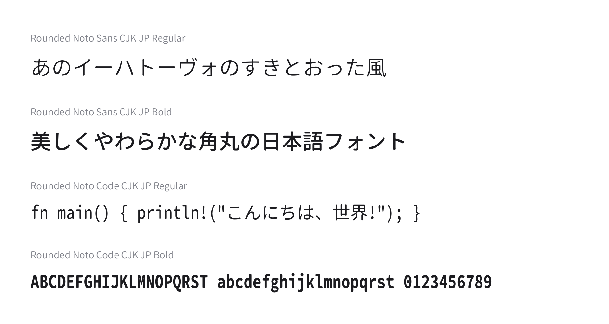
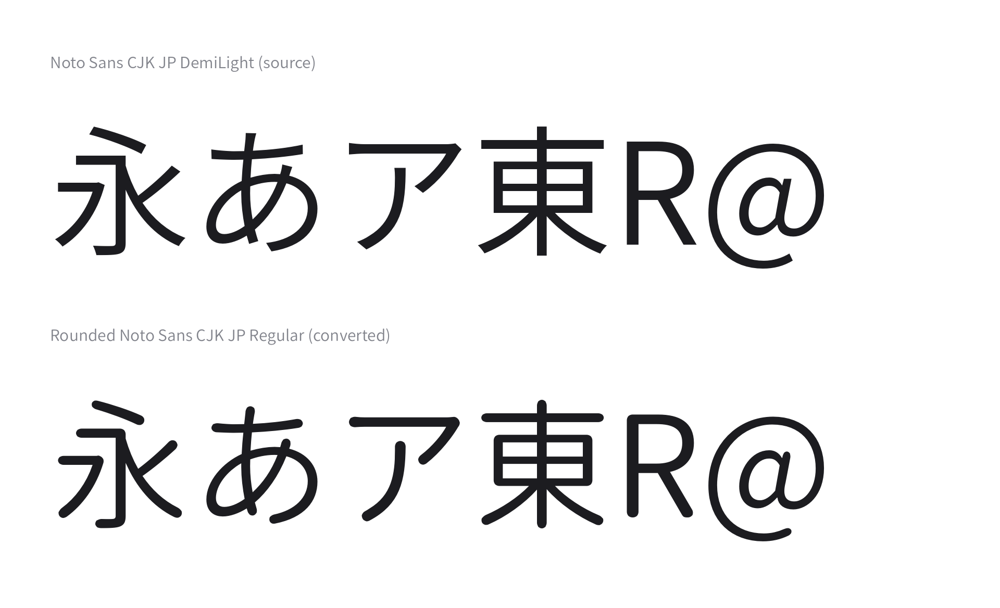

# rounded-noto-sans-cjk

[](https://github.com/sakikuroe/rounded-noto-sans-cjk/actions/workflows/ci.yml)

[English README](./README.md)

Noto Sans CJK JP・Noto Sans Mono CJK JP の全グリフの角を丸め、やわらかい印象の角丸日本語フォントファミリーを生成する Rust 製ツールです。CFF・CFF2・TrueType (`glyf`) のアウトラインを持つ静的な OpenType フォントであれば、他のフォントも変換できます。



このリポジトリをビルドすると、次の 4 フォントが得られます。

| ファミリー               | スタイル | 出力ファイル                               |
| ------------------------ | -------- | ------------------------------------------ |
| Rounded Noto Sans CJK JP | Regular  | `fonts/RoundedNotoSansCJKJP-Regular.otf`   |
| Rounded Noto Sans CJK JP | Bold     | `fonts/RoundedNotoSansCJKJP-Bold.otf`      |
| Rounded Noto Code CJK JP | Regular  | `fonts/RoundedNotoCodeCJKJP-Regular.otf`   |
| Rounded Noto Code CJK JP | Bold     | `fonts/RoundedNotoCodeCJKJP-Bold.otf`      |

## 仕組み



凸角は鋭いほど強く丸め、凹角は輪郭の自己交差を避けるため小さな固定半径で丸めたうえで、元の輪郭と補間して丸みの度合いを調整します。丸め半径の計算式は [Resource Han Rounded](https://github.com/CyanoHao/Resource-Han-Rounded) を基にしており、アルゴリズムの詳細は `src/round.rs` に記載しています。Mono フォントでは、ASCII 範囲を [Source Code Pro](https://github.com/adobe-fonts/source-code-pro) の輪郭に差し替えて独立したパラメータで丸めています。

## 必要な環境

- Rust 1.85 以降
- Python 3 と [fontTools](https://github.com/fonttools/fonttools)・[cffsubr](https://github.com/adobe-type-tools/cffsubr) (`cffsubr` は `PATH` に必要)
- 数 GB の空きメモリ (1 フォントの変換に数分かかります)

## フォントのビルド

コマンドはすべてリポジトリのルートで実行します。ライセンス上の理由からソースフォントは同梱していないため、以下の手順で `.gitignore` 済みの `fonts/` ディレクトリへダウンロードしてください。

### 1. Python ツールのインストール

```sh
pip install fonttools cffsubr
```

### 2. ソースフォントのダウンロードと前処理

Noto Sans CJK JP DemiLight (Sans Regular の変換元):

```sh
mkdir -p fonts/weights
curl -LO https://github.com/notofonts/noto-cjk/releases/download/Sans2.004/06_NotoSansCJKjp.zip
unzip -j 06_NotoSansCJKjp.zip "*DemiLight.otf" -d fonts/weights
```

Noto Sans Mono CJK JP Regular / Bold (Mono の変換元):

```sh
curl -LO https://github.com/notofonts/noto-cjk/releases/download/Sans2.004/11_NotoSansMonoCJKjp.zip
unzip -j 11_NotoSansMonoCJKjp.zip "*.otf" -d fonts
```

Noto Sans JP ウェイト 490 (Sans Bold の変換元)。このウェイトの静的ビルドは存在しないため、可変フォントからインスタンス化します。結果は TrueType 形式で輪郭の巻き方向が CFF と逆になるため、同梱のスクリプトで反転もしておきます。

```sh
curl -L -o "NotoSansJP[wght].ttf" "https://raw.githubusercontent.com/notofonts/noto-cjk/main/google-fonts/NotoSansJP%5Bwght%5D.ttf"
python3 -m fontTools.varLib.instancer -o NotoSansJP-w490.ttf "NotoSansJP[wght].ttf" wght=490
python3 scripts/reverse_contours.py NotoSansJP-w490.ttf fonts/NotoSansJP-w490-reversed.ttf
```

Source Code Pro (Mono フォントの ASCII 差し替え用):

```sh
curl -LO https://github.com/adobe-fonts/source-code-pro/releases/download/2.042R-u/1.062R-i/1.026R-vf/VF-source-code-VF-1.026R.zip
unzip VF-source-code-VF-1.026R.zip VF/SourceCodeVF-Upright.otf
python3 -m fontTools.varLib.instancer -o fonts/SourceCodePro-w480.otf VF/SourceCodeVF-Upright.otf wght=480

curl -LO https://github.com/adobe-fonts/source-code-pro/releases/download/2.042R-u/1.062R-i/1.026R-vf/OTF-source-code-pro-2.042R-u_1.062R-i.zip
unzip -j OTF-source-code-pro-2.042R-u_1.062R-i.zip OTF/SourceCodePro-Bold.otf -d fonts
```

ここまでで `fonts/` は次の構成になっているはずです (zip や中間ファイルは削除して構いません)。

```
fonts/
├── weights/
│   └── NotoSansCJKjp-DemiLight.otf
├── NotoSansJP-w490-reversed.ttf
├── NotoSansMonoCJKjp-Regular.otf
├── NotoSansMonoCJKjp-Bold.otf
├── SourceCodePro-w480.otf
└── SourceCodePro-Bold.otf
```

### 3. ビルド

```sh
cargo run --release --bin generate
```

`fonts.toml` を読み込み、冒頭の表に挙げた 4 フォントを `fonts/` に書き出します。

## フォント 1 本だけの変換

`fonts.toml` を使わずに 1 本だけ丸める場合は次を実行します。

```sh
cargo run --release --bin rounded-noto-sans-cjk -- <入力フォント> <出力フォント> [base_radius inner_radius t]
```

- `base_radius` — 凸角の基準半径 (既定値 `40.0`)
- `inner_radius` — 凹角に使う固定半径 (既定値 `5.0`)
- `t` — 元の輪郭と丸めた輪郭の補間率 `0.0`〜`1.0` (既定値 `0.85`)

## 設定

どの変換元をどのパラメータで変換するか、および結果に書き込むファミリー名・スタイル名は `fonts.toml` に定義しています。別のウェイトを変換したり丸みを調整したりするには `[[font]]` エントリーを編集してください。各フィールドの説明は同ファイルのコメントに記載しています。

## ライセンス

- **ソースコード** — [MIT License](./LICENSE)。丸め半径の計算式は Resource Han Rounded (Copyright © 2018–2022 Cyano Hao, MIT License) に由来します。[`THIRD-PARTY-NOTICES.md`](./THIRD-PARTY-NOTICES.md) を参照してください。
- **生成されるフォント** — 変換元フォントのライセンスに従います。Noto Sans CJK JP・Noto Sans Mono CJK JP・Source Code Pro はいずれも [SIL Open Font License 1.1](https://openfontlicense.org/) でライセンスされており、これらから生成したフォントにも同ライセンスが適用されます。

Noto CJK フォントは OFL 上の Reserved Font Name を宣言していないため、派生フォントの名前に "Noto" を含めることができます。生成されるフォントは、改変版であることが分かるよう "Rounded Noto …" と命名しています。一方 "Source" は Adobe の Reserved Font Name であり派生フォント名に使用できないため、Noto Sans Mono CJK JP と Source **Code** Pro の混植である等幅ファミリーは "Rounded Noto Code CJK JP" と命名しています。原著作権表示と商標表示 ("Noto" は Google Inc. の商標です) は `name` テーブルに保持されます。本プロジェクトは Google および Adobe とは無関係であり、両社の承認を受けたものではありません。
